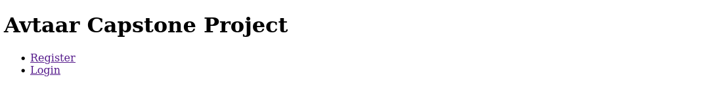
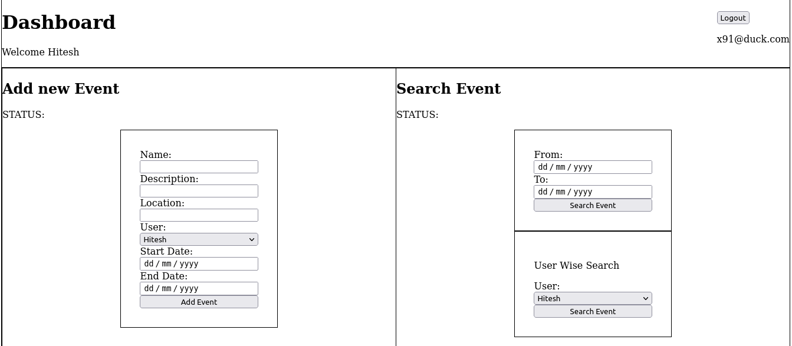
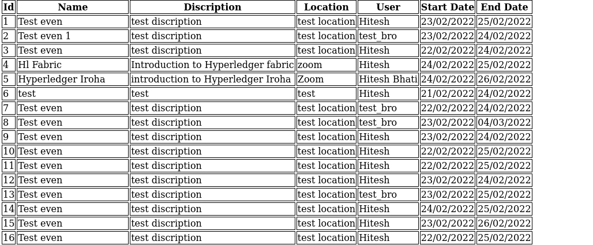

# Avtaar Capstone Project

Project Objective: Make a event management system where a user can create an account and can access below listed facility.

- Add new event
- Search events between a date range
- Search events for a specific user

>### Technology used
- NodeJS (14.19.0 / Backend- runtime environment)
    - Express (Api creation)
    - Pug (HTML template engine)
    - bcryptjs (Converting password into hash)
    - pg (database driver)
    - body-parser
    - client-sessions
    - momentjs

- Package manager:
    NPM (8.5.0) is used to manager all the libraries mentioned above
    
- Frontend
    - Used pug library which is a javascript HTML template library to generate HTML files.
    - CSS

>### DB Structure
I used **PostgreSQL** (12.0) database to store all data related to users and events, database tables are listed below.

Table 1: users table

- userid
- name
- age
- gender
- email
- password

Query
```
create table users(
    userid uuid primary key DEFAULT uuid_generate_v4(),
    name varchar(251) not null,
    age varchar(7) not null,
    gender varchar(51),
    email varchar(251) unique not null,
    password varchar(251) not null
);
```

Table 2: events table

- eventid
- name
- description
- location
- startdate
- enddate
- userid

Query
``` 
create table events(
    eventid serial primary key,
    name varchar(251) not null,
    description varchar(251),
    location varchar(51) not null,
    startdate date not null,
    enddate date not null,
    userid uuid not null,
    foreign key (userid)
    references users(userid)
);
```

>### API Structure
Express library is used to create REST API's and utilized in frontend to render frontend, interaction with database and implement logic.

List of API's are listed below:

Auth API are used to register, login and logout of a user.
- Auth API
    - GET: /auth/register
    - POST: /auth/register
    - GET: /auth/login
    - POST: /auth/login
    - POST: /auth/logout

Dashboard API are used to render home page and dashboard page after login.
- Dashboard API
    - GET: /
    - GET: /dashboard

Event API are used to handle GET and fetch of events.
- Events API
    - GET: /
    - POST: /
    - POST: /searchEvents
    - POST: /searchEventUserWise

>### Logic used
Logics are used to do conditional decision, data validity and many more, some of logics are listed below.

1. User authentication

This logic determine that, whoever is trying to login, into our system is registered or not.
```
if(users.rows.length == 0)
```

2. Event insertion

This logic check whether user has enterd valid dates or not.
```
if(yesterdayDate >= eventStartdate) 
            return res.render("dashboard", {status: "Event can not be scheduled in past", eventList: events.rows, username: `Welcome ${req.user.name}`, userList: users.rows, email: req.user.email});
        if(eventStartdate > eventEnddate) 
            return res.render("dashboard", {status: "Event end date should be greater than start", eventList: events.rows, username: `Welcome ${req.user.name}`, userList: users.rows, email: req.user.email});
```
3. Force login

This logic forces users to login, if not loged in than it will redirect user to login page.
```
function loginRequired(req, res, next){
    if(!req.user){
        return res.redirect("/auth/login");
    }
    next();
}
```

>### Screenshot
- Home Page


- Login Page


- Register Page


- Dashboard Page 1


- Dashboard Page 2


>### How to run this project
**Prerequisite**
- Node (14.19.0)
- NPM (8.5.0)
- PostgreSQL(12.0)
- git

**Database setup**

Your database username and password should be postgres else change in db.js file and port should be listening on 5432(postgresql default port).

steps:

Go to postgresql's psql command line interface and execute these commands in order

- Create database
```
CREATE DATABASE avtaar;
```
after this connect to avtaar database using "\c avtaar"

- This will create extension for out uuid(userid)

```
CREATE EXTENSION IF NOT EXISTS "uuid-ossp";
```

- Create users table
```
create table users(
    userid uuid primary key DEFAULT uuid_generate_v4(),
    name varchar(251) not null,
    age varchar(7) not null,
    gender varchar(51),
    email varchar(251) unique not null,
    password varchar(251) not null
);
```

- Create events table
```
create table events(
    eventid serial primary key,
    name varchar(251) not null,
    description varchar(251),
    location varchar(51) not null,
    startdate date not null,
    enddate date not null,
    userid uuid not null,
    foreign key (userid)
    references users(userid)
);
```

Now we are done with our database part, so now set up our server.

**Server setup**

- Clone this repo using
```
git clone https://github.com/0xhitesh-91/Avtaar-capstone.git
```

- Go into cloned directory using
```
cd Avtaar-capstone
```

- Now install all the required packages using
```
npm install
```

- Now run the server.js file
```
node server.js
```

**Hurray! setup is complete now go to localhost:3000 and test it out.**